<!--------------------------------------------------------------------------------------------------------------------------------------->
# 1 Introduction
<!--------------------------------------------------------------------------------------------------------------------------------------->

PM2.5, or outdoor suspended particulate matter is one of the most serious metropolitan pollutants. PM2.5 pollution has been shown to lead to many adverse health effects including but not limited to; respiratory illness, respiratory irritation, cardiovascular disease and pulmonary dysfunction [@xie2016]. To add to the negative health effects of PM2.5 pollution, particulate matter leads to negative economic effects such as decreased labor productivity and decreased work hours. In the U.S.A. it has been approximated that health-related loss of production costs employers $225 billion per year [@xie2016].

People living in cities are more specifically people living in close proximity to roadways are the most heavily impacted by particulate mater pollution [@dz2019]. This is due to the increased concentration of PM2.5 near roadways as well as the increased toxicity of the pollutants with respect to the regional background [@dz2019]. A large portion of the research relating to PM2.5 pollution in urban areas stems from China, where pollution is a cause for concern. There are studies performed on Canadian cities such as Vancouver and this study aims at contributing to the research that is done to help improve Canadian air quality.

This study will focus on the patterns of PM2.5 pollution and specifically the relationship between PM2.5 and income. A kriging interpolator was used to create a continuous surface of PM2.5 values to be examined. The Morans I statistic was also used to model the spatial auto correlation of both PM2.5 and income at both the global and local level. To attempt to predict income using PM2.5 values, both ordinary least squares regression and geographically weighted regression were used. Finally, a point pattern analysis of distribution of points that the kriging surface was generated from was performed to insure that the sample was random. The goal of this study was to identify the relationship between PM2.5 and income and to measure the amount of income variance that can be explained by PM2.5 levels.


<!--------------------------------------------------------------------------------------------------------------------------------------->
# 2 Study Area, Data and Descriptive Statistics
<!--------------------------------------------------------------------------------------------------------------------------------------->

## 2.1 Study Area

The study was conducted on the Metro Vancouver Area. The Metro Vancouver Area (MVA) encompasses 21 municipalities and has a total area of approximately 2,700km$^2$. The population of the MVA was recorded to be 2,463,431 in the 2016 census [@census2016]. The MVA has a population density of approximately 854.6/km$^2$ [@census2016] making it the most densely populated areas in British Columbia and one of the most densely populated areas in Canada. The study area defined for the subsequent analysis covers the majority of the MVA, with a total area of approximately 2,090km$^2$. The study will be focused on the MVA at the dissemination tract level with a mean dissemination tract area of 0.77km$^2$. Figure 1 below shows the defined study area in blue as well as the municipal boundaries of the MVA for context. 

```{r  echo=FALSE, fig.cap="Study Area Map of Metro Vancouver and Municipalities", out.width = '100%', fig.show='asis'}
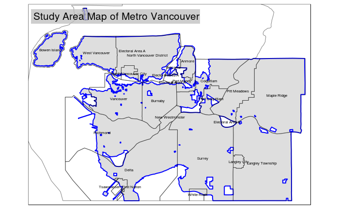
```

## 2.2 Data

### 2.2.1 Initial Data

Four initial data sets were used in this study. The first was a tabular data set of income data from 2016 collected by Census Canada at the dissemination area level. The next was a shapefile of dissemination area boundaries from 2016 also collected by Census Canada. The next data set was tabular data set of PM2.5 values provided by the Canadian Urban Environmental Health Research Consortium (CANUE). The final data set was a shapefile of postal code locations in British Columbia which would be used to give the PM2.5 values a spatial component.

### 2.2.2 Data Preprocessing

The data described previously was not suitable for an analysis in its raw form and required pre-preprocessing. First, the income data set was joined to the dissemination tracts using the common attribute of "DAUID". Any tract with an NA value for median income was subsequently removed. Next, the PM2.5 data was merged with the postal code data and then the PM2.5 values were aggregated per dissemination area to give each dissemination area one PM2.5 value. This PM2.5 dissemination area data set was then joined with the income dissemination data set to create one combined data set. Any NA values that resulted due to the merging processes were subsequently removed. Finally, a subset of points to use in the analysis was created by randomly selecting 290 points from the aggregated PM2.5 points data set.

## 2.3 Descriptive Statistics

Before performing any spatial analysis on the data, the data was explored and visualized to provide context. The mean median income value per dissemination area was found to be $33,854. The mean aggregated PM2.5 value per dissemination area was found to be 2.13 ppm. Furthermore, Figure 2 below shows a choropleth map of median income per dissemination tract in the MVA.

```{r echo=FALSE, fig.cap="Median Income Map of Metro Vancouver per Dissemenation Area", out.width = '100%'}
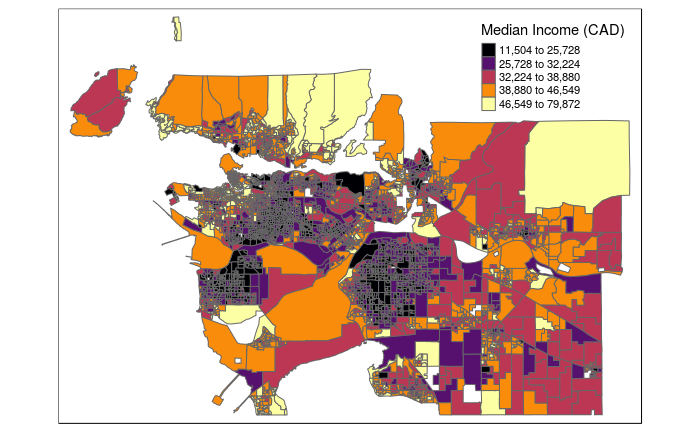
```

The subset of sample points created in Section 2.2.2 was also visualized. Figure 3 below shows the distribution of the sample points over the study area. The size of the point is proportional to the PM2.5 value.

```{r echo=FALSE, fig.cap="Plot of Sub-Sampled Points and PM2.5 values", out.width = '100%'}
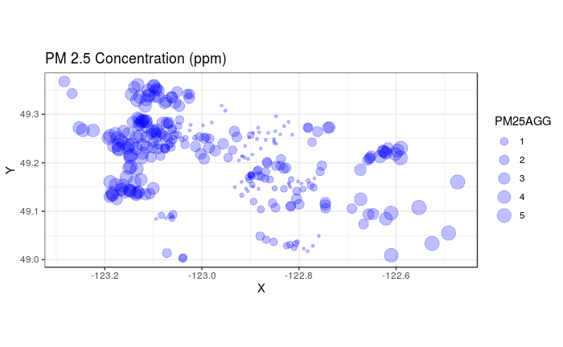
```

<!--------------------------------------------------------------------------------------------------------------------------------------->
# 3 Analysis Methods
<!--------------------------------------------------------------------------------------------------------------------------------------->

## 3.1 Morans I Statistic

### 3.1.1 Global Morans I

The Global Morans I statistic was performed on both the sub-sampled PM2.5 points as well as the median income values per dissemination tract. This was done to see if income or PM2.5 were spatially auto correlated in the MVA. The Global Morans I statistic evaluates a set of features and an associated attribute and determines whether the distribution of the features is clustered, random or dispersed.
The $I$ value is calculated as as follows:

$$I = \frac{n}{S_{0}} \frac{\sum_{i = 1}^{n} \sum_{j = 1}^{n} w_{i,j}z_{i}z_{j}}{\sum_{i = 1}^{n} z^{2}_{i}}$$

where $n$ is the total number of features, $S_{0}$ is the aggregated spatial weights between features $i$ and $j$. The $z_I$ score is calculated as follows:

$$z_{I} = \frac{I - E[I]}{\sqrt{V[I]}}$$

where $E[I] = -1/(n-1)$ and $V[I] = E[I^{2}] - E[I]^{2}$

### 3.1.2 Local Morans I

The Local Morans I statistic was also performed on both the sub-sampled PM2.5 points as well as the median income values per dissemination tract. The Local Morans I statistic evaluates a set of features and an associated attribute and gives each feature a value representing its level of spatial auto correlation. Its calculated similarly as the Global Morans I however instead of aggregating all values to one score of $I$ features are given a score of $Ii$ from $i$ to $n$ where $n$ is the number of features.

## 3.2 Kriging Interpolation

To create a continuous surface of interpolated PM2.5 values, a Universal Kriging method was applied to the data set. Universal Kriging is non-deterministic and incorporates a geostatistical model that includes spatial auto correlation. The distance between two sampled points in a kriging interpolation is assumed to reflect a spatial auto correlation between the two locations. The formula for the kriging interpolator is shown below: 

$$Z_{p}(p_{0}) = \sum_{i=1}^{n}w_{i}Z_{o}(p_i)$$

where $Z_{0}(P_{i})$ is the observed value at location $i$ and $Z_{p}(p_{o})$ is the predicted value at location 0. $w$ is the weight for each location, which is dependent on the kriging model used.

A first order polynomial trend surface was also added to to the Kriging interpolator as well as a spherical statistical model.

## 3.3 Linear Regression

After creating an interpolated surface using Kriging, a linear regression was performed on predicted PM2.5 values and the income value per dissemination tract. Income was chosen to be the dependent variable and PM2.5 was chosen as the independent variable. This simple linear regression equation would try and predict the median income of a dissemination tract given the PM2.5 concentration.


## 3.4 Morans I Statistic of Linear Regression Residuals

After the linear regression was completed another Global Morans I statistic was calculated on the regression residuals to analyze the distribution of the residuals. This was done to model the distribution and spatial auto correlation of the residuals.

## 3.5 Geographically Weighted Regression

To take non-stationary variables into consideration, a geographically weighted regression (GWR) was performed on the income and PM2.5 data. Income was chosen again to be the dependent variable and PM2.5 was chosen as the independent variable. GWR allows the relationship between income and PM2.5 to vary locally instead of measuring one global relationship like that of simple linear regression. GWR is a variation of simple linear regression that accounts for the spatial auto correlation of variables. 

## 3.6 Point Pattern Analysis

Two methods of distance based point pattern analysis were performed to determine the distribution of the sub-sampled points. First, K and L functions were calculated for the sub-sampled points. The K Function summarizes the distance between points for all distances. The L Function is variation of the K Function that makes it easier to compare observed versus expected values at low distances. Next, an average nearest neighbors analysis was performed on the sub-sampled points. The average nearest neighbor analysis measures the distance from each point to its nearest neighbor. The mean can then be taken from these distances to find the ANN distance.

<!--------------------------------------------------------------------------------------------------------------------------------------->
# 4 Results
<!--------------------------------------------------------------------------------------------------------------------------------------->

## 4.1 Morans I Statistic Results
### 4.1.1 Global Morans I Results

Figure 4 below shows the moran plot for median income per dissemination tract.

```{r echo=FALSE, fig.cap="Moran Plot of Median Income versus Spatially Lagged Median Income", out.width = '100%', fig.show='asis'}
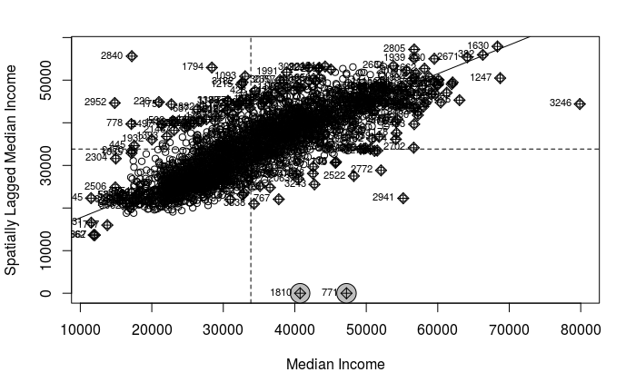
```

Figure 5 below shows the moran plot for PM2.5 values per dissemination tract.

```{r echo=FALSE, fig.cap="Moran Plot of PM2.5 versus Spatially Lagged PM2.5", out.width = '100%'}
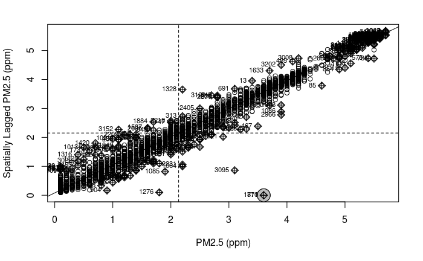
```

### 4.1.2 Local Morans I Results

Figure 6 below shows a choropleth map of the MVA representing Local Morans I values of median income per dissemination tract.

```{r echo=FALSE, fig.cap="Local Morans I map of Median Income", out.width = '100%'}
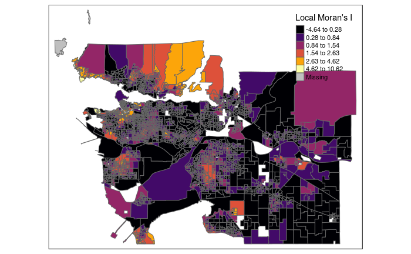
```

Figure 7 below shows a choropleth map of the MVA representing Local Morans I values of PM2.5 per dissemination tract.

```{r echo=FALSE, fig.cap="Local Morans I map of PM2.5", out.width = '100%'}
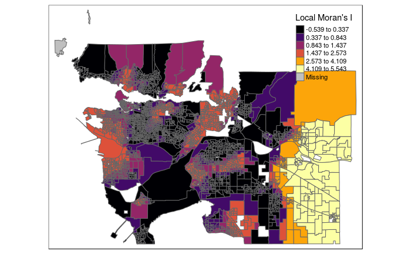
```

## 4.2 Kriging Interpolation Results

Figure 8 below shows the fitted kriging model used in the universal kriging interpolator. A spherical model was used with a sill of 3.45 and range of 36.46. These values were fitted by the software to try and fit the model optimally to the observed values.

```{r echo=FALSE, fig.cap="Spherical Kriging Model", out.width = '100%'}
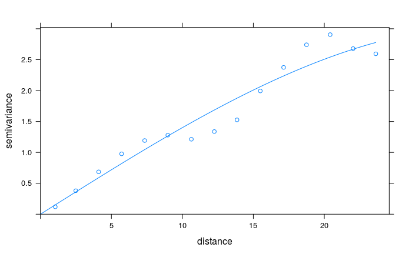
```

Figure 9 below shows the interpolated PM2.5 surface over the MVA.

```{r echo=FALSE, fig.cap="Interpolated PM2.5 Kriging Surface", out.width = '100%'}
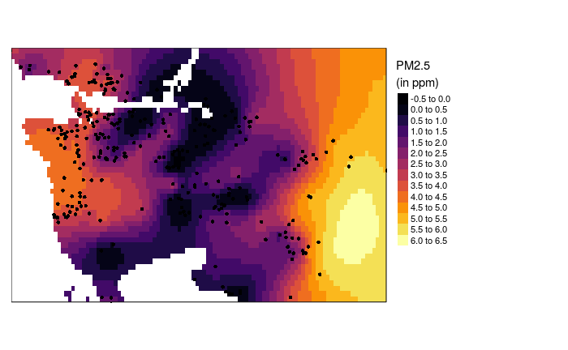
```

Figure 10 below shows the interpolated PM2.5 variance surface over the MVA.

```{r echo=FALSE, fig.cap="Interpolated PM2.5 Variance Surface", out.width = '100%'}
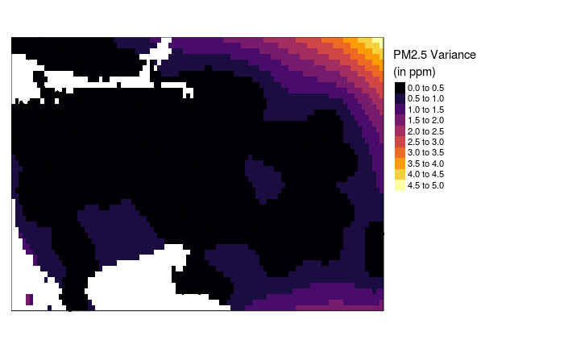
```

## 4.3 Linear Regression Results

The linear regression model reported a multiple $R^{2}$ value of 0.01731 and an adjusted $R^{2}$ value of 0.01654. The model had coefficients of 33506 for the intercept and 746.4 for the independent variable, PM2.5.

Figure 11 shows a map of the linear regression residuals over the MVA.

```{r echo=FALSE, fig.cap="Linear Regression Residuals Map", out.width = '100%'}
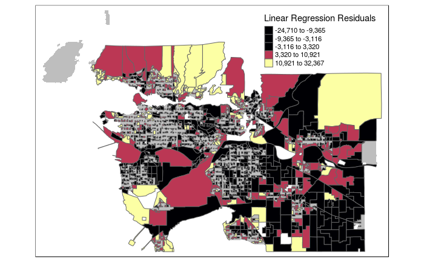
```

## 4.4 Morans I Statistic of Linear Regression Residuals Results

The Morans I Statistic for regression residuals test had an Observed Morans I value of 0.5479 and an expected value of -0.0016, with a variance of 0.0007 and p-value of 2.2$e-16$.

## 4.5 Geographically Weighted Regression Results

Figure 12 shows a map of the GWR R2 values over the MVA.

```{r echo=FALSE, fig.cap="GWR R2 Values Map", out.width = '100%'}
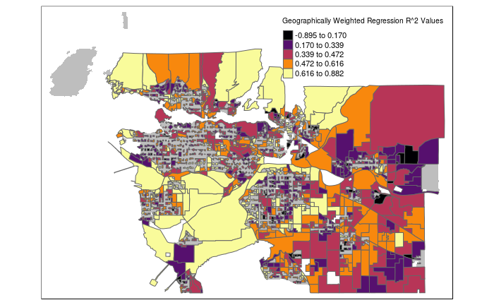
```

Figure 13 shows a map of the GWR coeffcient values over the MVA.

```{r echo=FALSE, fig.cap="GWR Coefficient Values Map", out.width = '100%'}
knitr::include_graphics("imgs/regcoeff.png")
```

## 4.6 Point Pattern Analysis Results

### 4.6.1 K Function Results

Figure 14 shows a plot of the K Function calculated on the rasterized sub-sampled PM2.5 points. 

```{r echo=FALSE, fig.cap="K Function Plot", out.width = '100%'}
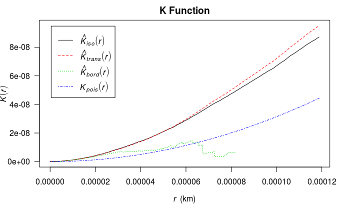
```

### 4.6.1 L Function Results

Figure 15 shows a plot of the L Function calculated on the rasterized sub-sampled PM2.5 points.

```{r echo=FALSE, fig.cap="L Function Plot", out.width = '100%'}
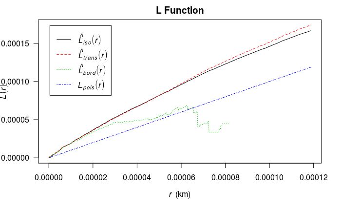
```

### Average Nearest Neighbors Results

Figure 16 shows a plot of the 100 nearest neighbors and there distances from a given location.

```{r echo=FALSE, fig.cap="Average Nearest Neighbours Plot (k = 100)", out.width = '100%'}
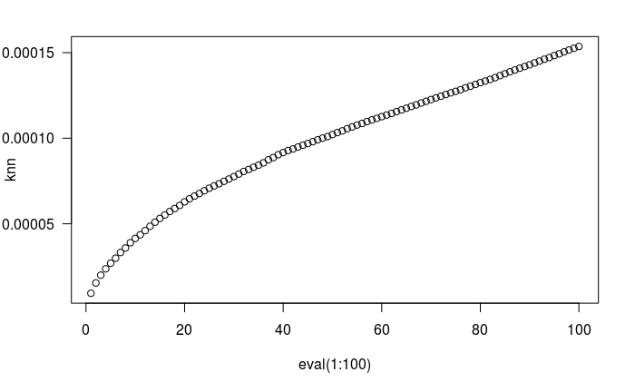
```

<!--------------------------------------------------------------------------------------------------------------------------------------->
# 5 Discussion
<!--------------------------------------------------------------------------------------------------------------------------------------->
The Global Morans I plots of median income and PM2.5 (Figures 4 - 5) show that both income and PM2.5 have a weak positive spatial auto correlation. Furthermore, the Local Morans I maps of income and PM2.5 (Figures 6 -7) show some areas of high positive spatial auto correlation. Figure 6, the Local Morans I map for income shows some highly correlated areas in the downtown area, however the results are largely show weak to random spatial auto correlation. Alternatively, the Local Morans I map for PM2.5 (Figure 7) shows strong positive correlation in the south-east regions of the MVA.

The interpolated surface produced by kriging (Figure 9) shows high concentrations of PM2.5 in the north-west as well as south-east regions of the MVA. The central regions of the MVA were interpolated with relatively low levels of PM2.5. Figure 8 shows the stochastic model used by the kriging interpolator. All though it does fit the points well, it would have benefit from a model type that better fit the data such as a polynomial or a cosine function. Figure 10 shows the variance surface produced by the kriging model. The surface shows low variance in the central regions and higher variance as one migrates outwards.

The linear regression ran on the data, with median income as the dependent and PM2.5 as the independent variable reported low $R^{2}$ value of 0.0731 and an adjusted $R^{2}$ value of 0.01654. This indicates that PM2.5 alone was not a good predictor of median income in the MVA. 

The Morans I test ran on the linear regression residuals reported a random distribution of residuals, indicating that the residuals were not spatially correlated. This reflects the uncertainty outlined previously by the linear regression model.

The geographically weighted regression was a better predictor of median income with high $R^{2}$ values in the surrounding regions of the MVA. Figure 12 shows the distribution of local$R^{2}$ values. The main benefit of GWR over regular ordinary least squares regression is that GWR allows the independent and dependent variable to vary across space [@fotheringham2017]. Higher coeffcient values as seen in Figure 13 were also seen on the outer regions of the MVA, which is similar to the variance surface produced previously

The point pattern analysis performed on the sampled points show that the sampled points were randomly distributed in the MVA. The K function shown in Figure 14 shows that the observed K values are very similar to the expected K values, indicating a random distribution. Furthermore, Figure 16, the average nearest neighbor plot shows that the 100 closest neighboring points distances increase in a linear pattern, which indicates a random distribution. This is because as the order of the points increases, so does the distance.

<!--------------------------------------------------------------------------------------------------------------------------------------->
# 6 Conclusion
<!--------------------------------------------------------------------------------------------------------------------------------------->
In conclusion, geographically weighted regression provides evidence that there is a relationship between income and PM2.5 levels in the MVA, however the model used is extremely limited and cannot explain all the variation of the dependent variable of median income. The biggest limit to the regression analysis used in this study was the number of parameters. Many studies that utilize regression use many parameters to explain the variation of the dependent variable opposed to just one as is the case in this study. In addition, the kriging surface was limited by its stochastic model as well as its trend function, which could benefit from deeper refinement. Geographically weighted regression is a great tool as it takes locality and spatial trends into account unlike ordinary least squares regression, and with further refinement it could explain a lot about the income and PM2.5 patterns in the MVA.
<!--------------------------------------------------------------------------------------------------------------------------------------->
<!--------------------------------------------------------------------------------------------------------------------------------------->

### Project Resources:

github link: https://github.com/kingschultz21/418-finalproject
